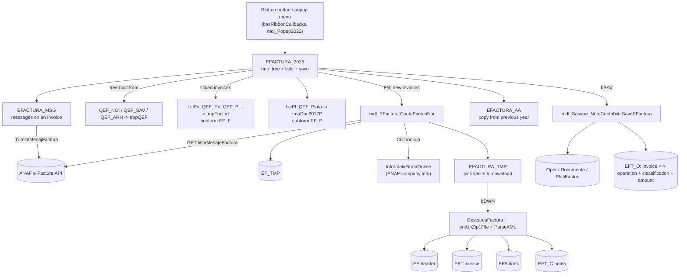
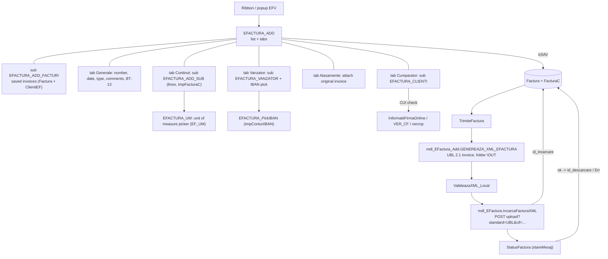

# E-Factura in Avacont.accdb: how the pieces fit

Read this first. It explains the shape of the e-invoice feature; the other files hold the detail
(`forms/`, `data-model.md`, `queries.md`, `code.md`, `navigation.md`, `matrix.md`,
`external-dependencies.md`, `shared-tables.md`). Everything here was derived from the raw export in
`Surse/RawExport`; statements marked *(inferred)* come from reading names and call patterns, not from
running the app.

## 1. Two features share one name

| | Received invoices ("facturi primite") | Issued invoices ("facturi vanzare") |
|---|---|---|
| Direction | supplier -> the unit | the unit -> customer |
| Hub form | `EFACTURA_2025` | `EFACTURA_ADD` |
| Where the data lives | `EF`, `EFT`, `EFS`, `EFT_O`, `EFT_C`, `EFT_M` (linked from `ef_2026.accdb`) | `Factura`, `FacturaC`, `ClientiEF` (linked from the unit's `baza2026.accdb`) |
| ANAF calls | `listaMesajeFactura`, `descarcare`, message list/download, company info | `upload` (UBL XML), `stareMesaj`, `descarcare` |
| Ends in | accounting operations and payment documents (`SaveEFactura`) | an upload index (`id_incarcare`) and a download id (`id_descarcare`) on `Factura` |

Both talk to the ANAF e-invoice web service with the same OAuth bearer token
(`mdl_2025.Token_Key`, refreshed by `Token_RefreshKey` / `mdl_2026.RefreshAccessToken`; the token is
stored in the Windows registry under `AVACONT\<DC>\Tokens`, so it is per workstation, not in a table).

## 2. Received invoices

What each step really does:

1. **Find new invoices.** `FN_Click` on `EFACTURA_2025` checks the token (`Token_Key`, `Token_Expiry`),
   asks for the number of days (`Make_Popup_EFactura_NumarZile`), then `CautaFacturiNoi` calls
   `GET .../listaMesajeFactura?zile=N&cif=<UNIT.CUI>` and keeps messages of type `FACTURA PRIMITA`
   that are not yet in `EF` (matched on `EF.id_sol` = the ANAF `id_solicitare`). Message types
   `MESAJ CUMPARATOR TRANSMIS/PRIMIT`, `ERORI FACTURA`, `FACTURA TRIMISA` are skipped. The
   candidates go to the local table `EF_TMP`.
2. **Choose and download.** If the scheme flag `Scheme(NumeForm='DPIFV').C2` is on, the supplier
   CUIs are looked up (`InformatiiFirmaOnline` -> `clsFirme`) and `EFACTURA_TMP` is shown for ticking;
   otherwise everything is downloaded directly (`DescarcaFacturi`). Each download is a zip; it is
   unpacked into the e-invoice folder (`CALE.CALEEF`, via `mdl_2025.CALE_EF`) and `ParseXML` reads the
   UBL XML into `EF` / `EFT` / `EFS` / `EFT_C`. `ParseXML_ERR` records bad files in `EF_ERR`;
   `ParseXML_Manual` and `PrelucreazaZipLocal` are the manual "load XML / zip from disk" path.
3. **Show the tree.** `Pop_EFACTURA_25` fills `tmpQEF` from `QEF_NOI` (new), `QEF_SAV` (saved) or
   `QEF_ARH` (archived/hidden) depending on `FACTURI` = 1/2/3, then loads the tree (`clsTreeView`,
   handlers `mcTree_*`). The tree columns total / saved / remaining (`TotalFactura`, `TotalSalvat`, `TotalRamas` in `tmpQEF`)
   are `EFT.Total` minus the sum of `EFT_O.Suma` *(inferred: the exact node levels are built in
   `Pop_EFACTURA_25`, read it before porting the tree)*.
4. **Book it.** Ticking an invoice runs `AdaugaDate_Evidentiere` (queries `QEF_EV`, `QEF_PL` into
   `tmpFacturi`, shown by subform `EF_F`) and `AdaugaDate_Plata` (`QEF_Plata` into `tmpDoc2017P`,
   shown by `EF_P`). The operator fills classification (`Note_PickClsf`), partner, contract, then
   `bSAV_Click` calls `SaveEFactura`, which creates the accounting operations and records
   `EFT_O` rows. `EFT.S` / `EFT.Complet` flag saved / complete invoices.
5. **Year change.** `EFACTURA_AA` moves open invoices to the new year through `tmpEF_TRANS`, `EF`,
   `EFT`, `EFS`, `EFT_C` (`QEF_TRECERE` / `mdl_TRECERE_AN.TrecereAN` are the query/procedure side).
6. **Messages and PDF.** `EFACTURA_MSG` shows `EFT_M` and sends a buyer message
   (`TrimiteMesajFactura`, XML built by `GenereazaXMLMesaj`). `EFACTURA_PDF`, `MF_PDF_EF`,
   `Note_PDF_EF` are three copies of a small PDF viewer form bound to `EF`, reading
   `<CaleAvacont>\PDF\<id_sol>.pdf` (the file is produced by `DescarcaFacturaPDF` / `Export_XML_TO_PDF`).

### Association with existing accounting documents

Two more groups work on invoices already booked elsewhere. They are opened from
`MF2019_1` (handler `EF_MouseUp`, so a mouse click on an EF control *(inferred which button)*) and from `Note` (`Form_Load`):

- `MF2019_Asoc_EF` / `_MF2019_Asoc_EF` (+ `MF_PDF_EF`): attach an e-invoice to an accounting
  document in `MF2019`; data in `tmpMF_EFactura` via queries `qMF_EFactura_Initial/Ramas/Toate`.
- `Note_EFactura` (+ `Note_PDF_EF`): same idea for the `Note` document form; data in
  `tmpNote_EFactura` via `qNote_EFactura_Toate`, `_qNote_EFactura_Initial/Asociat_Nou`,
  `_qNote_EFacturat_Ramas`. `_TempCredit` carries credit notes (`EFT.Tip = 'NC'`, signed -1).

## 3. Issued invoices

- Invoice lines are edited in the local table `tmpFacturaC` (subform `EFACTURA_ADD_SUB`) and written
  to `FacturaC` on save; `EFACTURA_ADD` footer shows `DSum("Valoare","tmpFacturaC")`.
- `GENEREAZA_XML_EFACTURA(IdFactura)` writes `<CaleEF>\OUT\<Scheme.T3>_<number>_<yyyy_mm_dd>.xml`
  built with `AddSupplierParty`, `AddCustomerParty`, `AddPaymentMeans`, `AddTaxTotal`,
  `AddLegalMonetaryTotal`, `AddInvoiceLine` (data from `Factura`, `FacturaC`, `qFacturi_Vanzare`,
  `BIC`, `Scheme`, `Z`). A copy of an uploaded file goes to `<CaleEF>\UPL\`.
- Unit-specific settings (supplier data, series, flags such as `C2`, `T3`) live in `Scheme`
  (row with `NumeForm='DPIFV'`); `Setari implicite` is the form that edits them.

## 4. Storage map

| Where | What |
|---|---|
| `Avacont.accdb` (local) | `EF_TMP`, `EF_ERR`, `EF_UM`, `EF_EXITCODES`, `EF_F`, `TEF_F`, `TEF_FF`, `TrecereEFactura`, all `tmp*` work tables, `tblMSG`, `Scheme`, `CONFIGS`, `CALE`, `UNIT` and the whole accounting set |
| `C:\AVACONT\EFACTURA\ef_2026.accdb` | `EF`, `EFS`, `EFT`, `EFT_C`, `EFT_M`, `EFT_O` (the e-invoice store; the export of `EF_2025.accdb` is in `Surse/RawExport/EF_ACCDB`) |
| `C:\AVACONT\ENERGETIC LOCAL\baza2026.accdb` (one per unit) | `Factura`, `FacturaC`, `ClientiEF`, `UNIT`, `Jud`... |
| Disk, under `CALE.CALEEF` | `\OUT` (generated XML), `\UPL` (uploaded copies), downloaded zips/XML, `\PDF\<id_sol>.pdf` |
| Windows registry | OAuth tokens under `AVACONT\<DC>\Tokens` |

## 5. What is generic infrastructure (not e-invoice logic)

The forms lean on a house UI toolkit that K-BOT already replaces with its own controls; see
`external-dependencies.md` for the counts. In short: `clsTreeView` (+ `clsTreeNode`, `clsTreeView_Icons`)
is the tree; `clsDatePicker*` the date popups; `clsAnchorManager` + `clsSplitter` the resize layout;
`mdl_MsBox` / `mdl_Messagebox_hook` the message boxes; `mdl_Popup2022` the context menus;
`mdl_DebugPrint` / `clsTrace` (the `ADD_TRACE` / `REM_TRACE` pairs) the logging; `clsRegExp`,
`ParseJson`, `clsHTTP_Async`, `clsMeter` small helpers.

## 6. Things to keep in mind when rebuilding

- Several forms are near-duplicates: `EF_F` and `EF_F_inlucru` (same layout, one bound to
  `tmpFacturi`, the other to `EF_F`), `EFACTURA_PDF` / `MF_PDF_EF` / `Note_PDF_EF` (identical PDF
  viewers), `MF2019_Asoc_EF` and `_MF2019_Asoc_EF` (old/new). Decide which survive before porting.
- Almost every screen works through local `tmp*` tables filled by append queries and then edited;
  K-BOT will want in-memory models or its own staging tables instead.
- Strings with the ANAF message types, the `Tip` codes (`FC`, `NC`, ...), and the status words
  (`in prelucrare`, `ok`, `Err`) are the contract with the service; keep them verbatim.
- The registry-held token and the per-unit database split are the two storage facts that do not
  map directly to K-BOT's MariaDB model; they need a decision.
