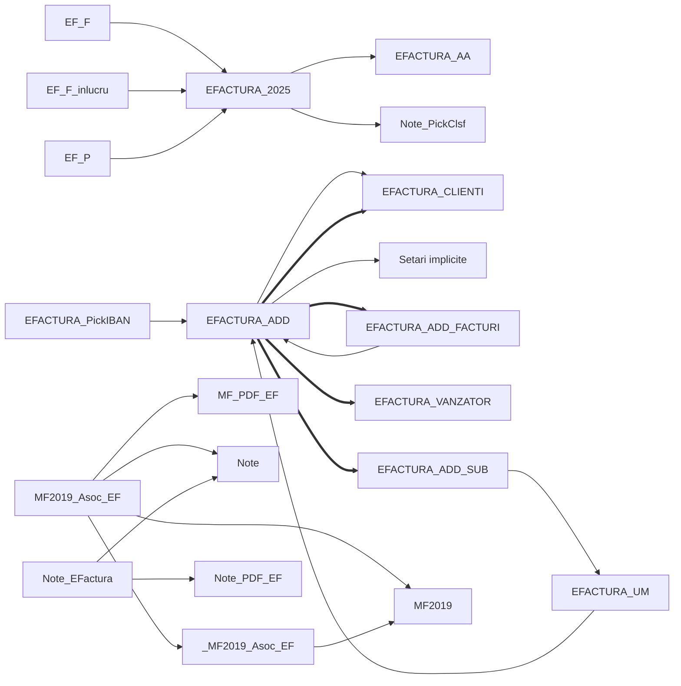

# Navigation: who opens whom

## Form graph

Solid arrow = opens (DoCmd.OpenForm / Forms! reference in code or query); thick = hosts as subform.

## Entry points: code outside the scope that opens these forms

| Object | Procedure | Opens |
|---|---|---|
| module:basRibbonCallbacks | OnActionButton | `EFACTURA_2025`, `EFACTURA_ADD` |
| module:mdl_Popup2022 | Popup_Efactura_2022 | `EFACTURA_2025` |
| module:mdl_Popup2022 | EF_OP | `EFACTURA_2025` |
| module:mdl_Popup2022 | Popup_EFactura_Optiuni | `EFACTURA_ADD` |
| module:mdl_Popup2022 | PP_EF_OPT | `EFACTURA_ADD` |
| module:mdl_Popup2022 | OPT_EF | `EFACTURA_ADD` |
| module:mdl_Popup2022 | Popup_EFactura_IncarcaXML | `EFACTURA_2025` |
| module:mdl_Popup2022 | EF_ZILE | `EFACTURA_2025` |
| module:mdl_Popup2022 | EFV | `EFACTURA_ADD` |
| module:mdl_Popup2022 | Popup_EFactura_Raport | `EFACTURA_2025` |
| module:mdl_Popup2022 | PP_EF_Raport | `EFACTURA_2025`, `EFACTURA_MSG` |
| module:mdl_Salvare_NoteContabile | SaveEFactura | `EFACTURA_2025` |
| module:mdl_Salvare_NoteContabile | SaveBurse | `EFACTURA_2025` |
| form:MF2019_1 | EF_MouseUp | `MF2019_Asoc_EF` |
| form:Note | Form_Load | `EFACTURA_2025` |

## Entry points: queries that read these forms (parameters)

| Query | Reads form controls of |
|---|---|
| QEF_EV | `EFACTURA_2025` |
| QEF_PL | `EFACTURA_2025` |
| QEF_Plata | `EFACTURA_2025` |
| QEF_RestDePlata | `EFACTURA_2025` |
| QEF_RestDePlata_Data | `EFACTURA_2025` |
| SAV_ACTIUNE_EV | `EFACTURA_2025` |
| SAV_ACTIUNE_PL | `EFACTURA_2025` |
| SAV_Cont8067_EV | `EFACTURA_2025` |
| SAV_Cont8067_PL | `EFACTURA_2025` |
| SAV_Credit_EV | `EFACTURA_2025` |
| SAV_Credit_PL | `EFACTURA_2025` |
| SAV_Debit_EV | `EFACTURA_2025` |
| SAV_Debit_PL | `EFACTURA_2025` |
| SAV_Document_EV | `EFACTURA_2025` |
| SAV_OP | `EFACTURA_2025` |
| SAV_OPER_EV | `EFACTURA_2025` |
| SAV_OPER_PL | `EFACTURA_2025` |
| SAV_PlatiFacturi | `EFACTURA_2025` |